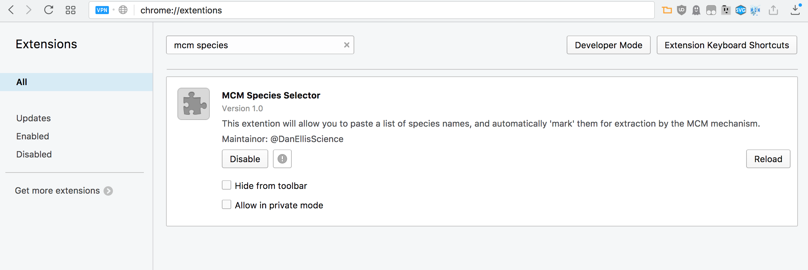

## MCM species selector applet 
A simple chrome extention that allows you to paste a comma sepeated list of species into the website.

### Installing
1.Go to `chrome://extentions` in the url box

2.Drag and drop the following file <a href='https://github.com/wolfiex/CoolStuff/raw/master/MCMchromeExtention/MCMextention.nex'>download Extention here> file into the open window. 

3. Install and Enjoy 
